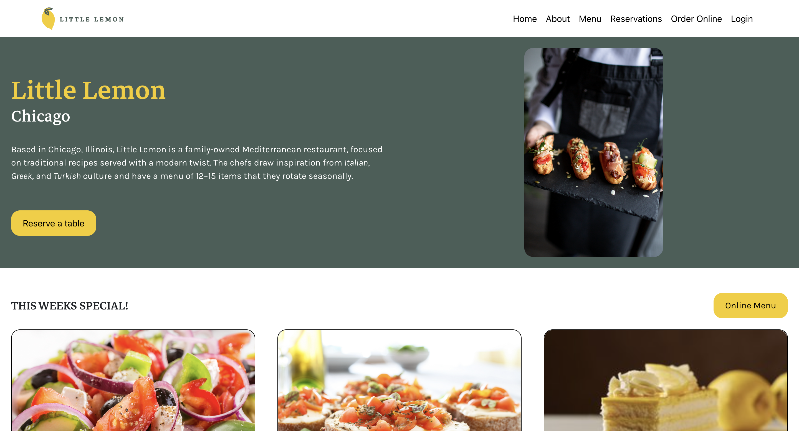
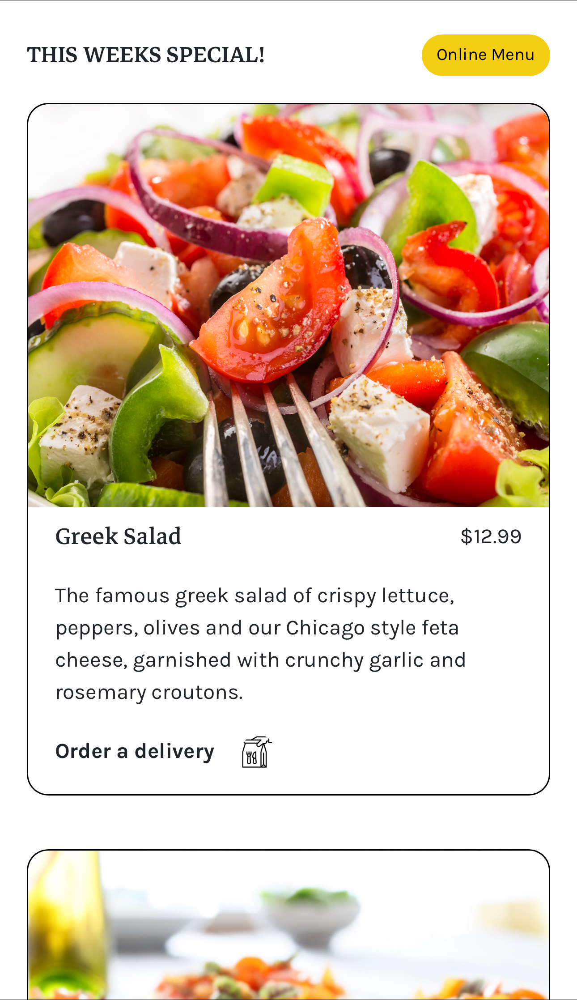
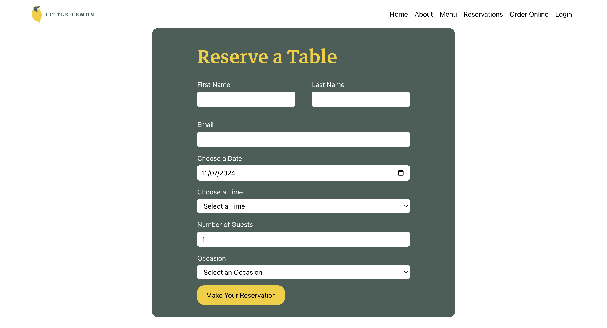
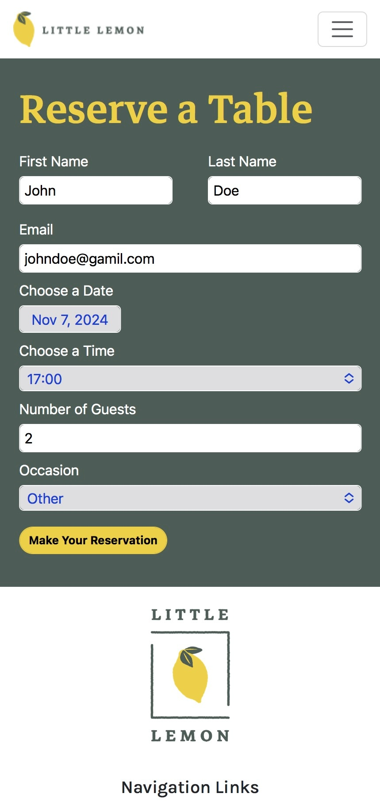

# Reserve a Table with Little Lemon

## Project Overview
This capstone project demonstrates the skills and knowledge I have gained throughout the **Meta Front-End Developer Specialization Program**.

The goal of this project is to develop an online table reservation feature for the fictional Little Lemon restaurant website, to allow customers to easily reserve tables based on their preferred date, time, and party size. By providing customers with a simple and intuitive interface for making reservations, this feature aims to increase customer satisfaction while improving the efficiency of the restaurant's operations.

## Key Features
### Responsive Design
The project is designed to adapt to different screen sizes and devices to provide users with a seamless experience

### **Desktop View of the Homepage**


### **Mobile View of the Homepage**



### Customer Reservation System
Allows customers to select the date, time, and the number of guests for to reserve a table
#### **Desktop View of the Reservation Form**


#### **Mobile View of the Reservation Form**


### Form Data Handling
Utilizes **Formik** to manage the reservation form's state, handle form submission, and capture user inputs

### Form Data Validation
**Yup** is used to validate all form inputs to ensure that all required fields are filled out properly

## Technologies Used
- **Front-end**
  - **React:** Created the UI with reusable components. Components were used to organize the different pages and sections of the website
  - **Bootstrap:** Used specifically to create a responsive and mobile-friendly navbar
  - **Formik:** Used to handle form state and submission for the reservation form
  - **Yup:** Used to validate reservation form inputs. If any required fields are left empty or incorrectly filled out, **Yup** generates error messages to guide users
- **Testing**
  - **Jest:** Used for unit and integration testing to ensure the app behaves as expected.

## Installation Instructions
### 1. Clone this entire repository
Since this project is a subdirectory of this repository, you'll need to clone the entire repository first
```bash
git clone git@github.com:michellehuyen/meta-frontend-certificate.git
```

### 2. Navigate to the project directory
After cloning the repository, navigate to the subdirectory containing the capstone project
```bash
cd C8-Front-End-Developer-Capstone/
```
### 3. Install all required dependencies
Make sure you are inside the C8-Front-End-Developer-Capstone/ directory, then run:
```bash
npm i
```
