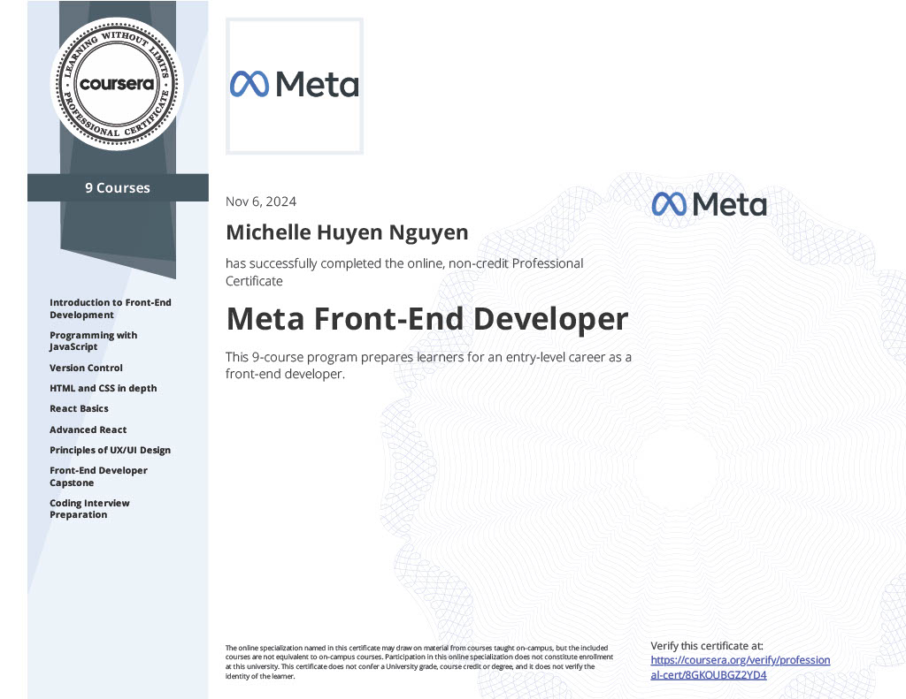

# Meta Front-End Developer Specialization Certificate

## Overview
I recently completed the **Meta Front-End Developer Specialization Certificate by Meta on Coursera**.

## Courses Completed
This specialization consists of the following courses:
1. Introduction to Front-End Development
2. Programming with JavaScript
3. Version Control
4. HTML and CSS in depth
5. React Basics
6. Advanced React
7. Principles of UX/UI Design
8. Front-End Developer Capstone
9. Coding Interview Preparation

## Technologies and Tools Used
### Languages
- HTML
- CSS
- JavaScript

### Libraries/Frameworks
- React
- Bootstrap

### Version Control
- Git
- GitHub

### Tools
- VS Code
- Figma
- Jest
